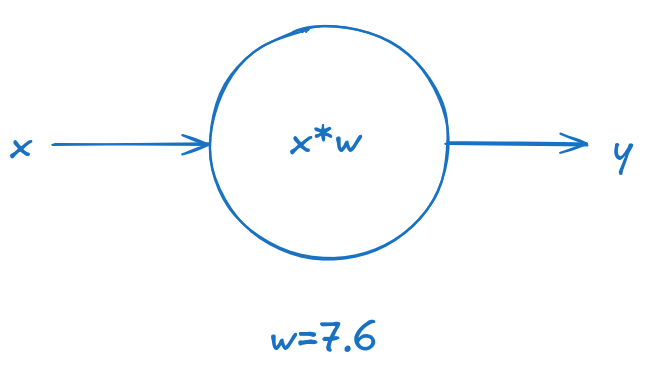
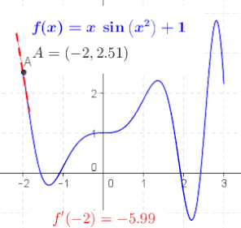
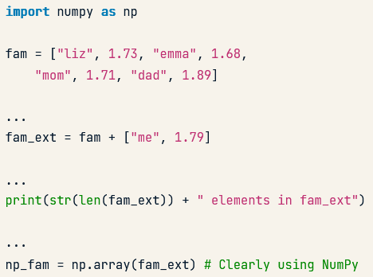
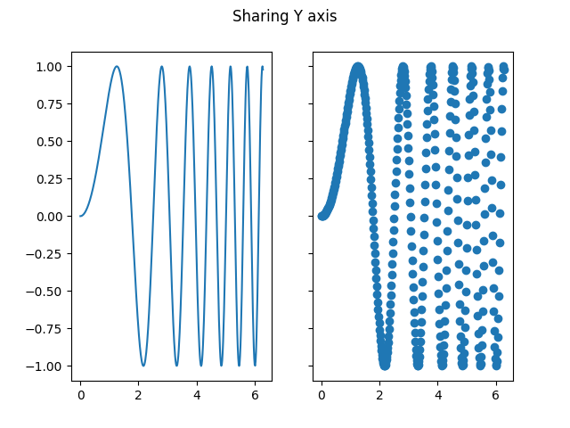
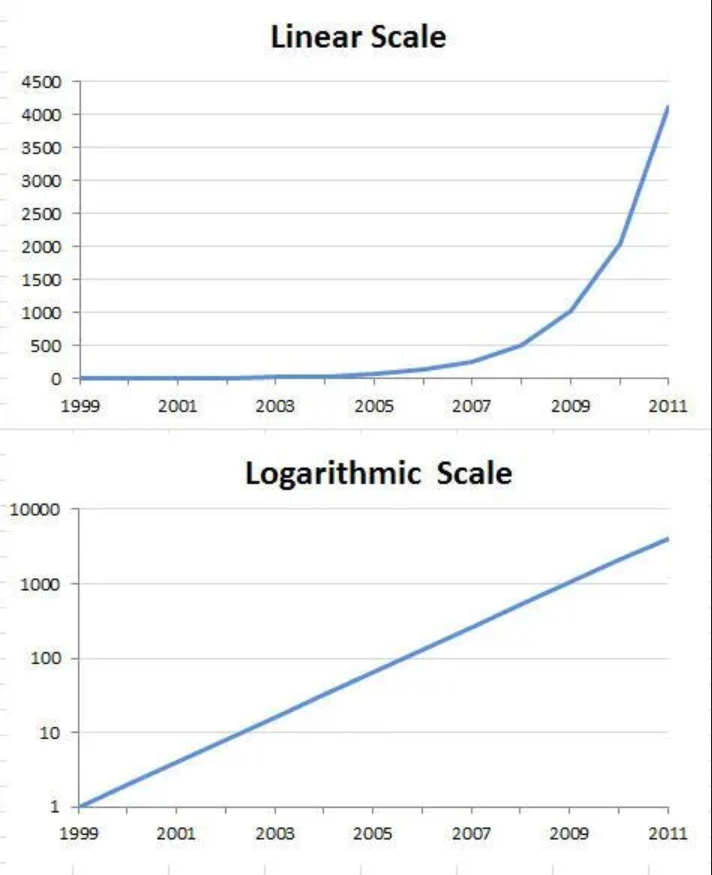
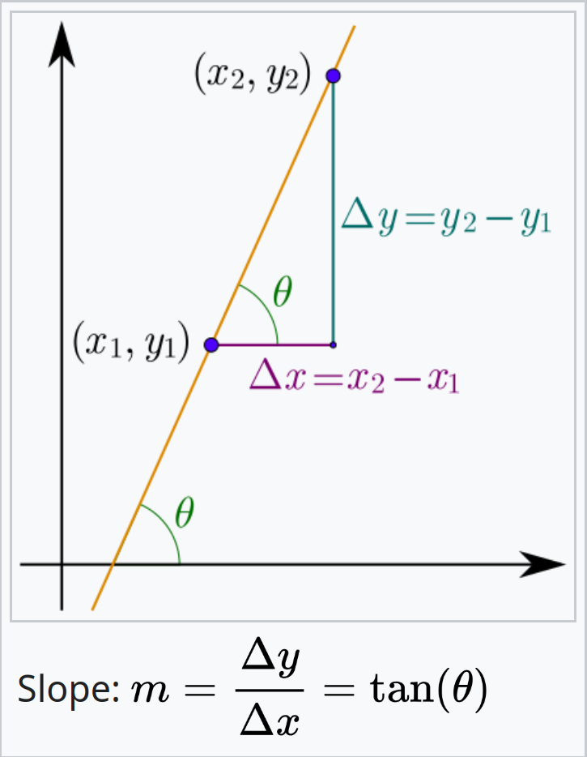
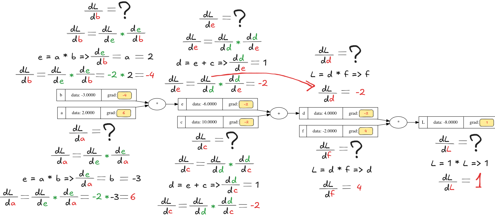
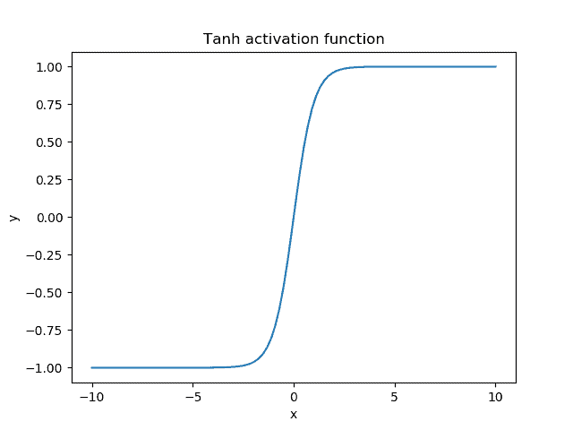
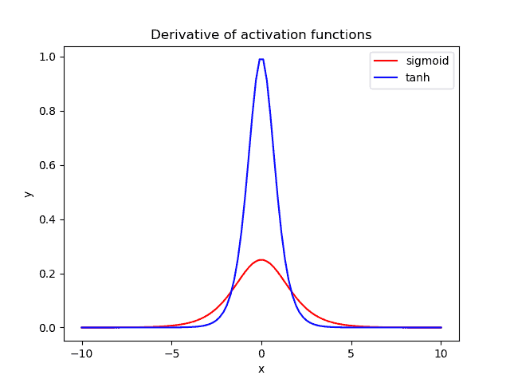

# Table of Contents

- [Table of Contents](#table-of-contents)
- [Week 01 - Hello, Deep Learning. Implementing a Multilayer Perceptron](#week-01---hello-deep-learning-implementing-a-multilayer-perceptron)
  - [So what can deep learning models model?](#so-what-can-deep-learning-models-model)
  - [Modeling a neuron that can multiply by `2`](#modeling-a-neuron-that-can-multiply-by-2)
  - [Python Packages](#python-packages)
    - [Introduction](#introduction)
    - [Importing means executing `main.py`](#importing-means-executing-mainpy)
  - [NumPy](#numpy)
    - [Context](#context)
    - [Problems](#problems)
    - [Solution](#solution)
    - [Benefits](#benefits)
    - [Usage](#usage)
    - [2D NumPy Arrays](#2d-numpy-arrays)
    - [Basic Statistics](#basic-statistics)
    - [Generate data](#generate-data)
  - [Matplotlib](#matplotlib)
    - [Line plot](#line-plot)
    - [Scatter plot](#scatter-plot)
    - [Drawing multiple plots on one figure](#drawing-multiple-plots-on-one-figure)
    - [The logarithmic scale](#the-logarithmic-scale)
    - [Histogram](#histogram)
      - [Introduction](#introduction-1)
      - [In `matplotlib`](#in-matplotlib)
      - [Use cases](#use-cases)
    - [Checkpoint](#checkpoint)
    - [Customization](#customization)
      - [Axis labels](#axis-labels)
      - [Title](#title)
      - [Ticks](#ticks)
      - [Adding more data](#adding-more-data)
      - [`plt.tight_layout()`](#plttight_layout)
        - [Problem](#problem)
        - [Solution](#solution-1)
  - [Random numbers](#random-numbers)
    - [Context](#context-1)
    - [Random generators](#random-generators)
  - [A note on code formatting](#a-note-on-code-formatting)
- [Week 02 - Implementing Gradient Descent](#week-02---implementing-gradient-descent)
  - [Backpropagation](#backpropagation)
  - [Topological sort](#topological-sort)
  - [The hyperbolic tangent](#the-hyperbolic-tangent)
  - [Python OOP (Magic Methods)](#python-oop-magic-methods)
    - [Initialization and Construction](#initialization-and-construction)
    - [Arithmetic operators](#arithmetic-operators)
    - [String Magic Methods](#string-magic-methods)
    - [Comparison magic methods](#comparison-magic-methods)
- [Week 03 - Hello, PyTorch](#week-03---hello-pytorch)
  - [PyTorch. A deep learning framework](#pytorch-a-deep-learning-framework)
  - [Tensors. The building blocks of networks](#tensors-the-building-blocks-of-networks)
    - [What is a tensor?](#what-is-a-tensor)
    - [Creating tensors](#creating-tensors)
    - [Useful attributes](#useful-attributes)
    - [Shapes matter](#shapes-matter)
    - [Multiplication](#multiplication)
  - [Our first neural network using PyTorch](#our-first-neural-network-using-pytorch)
  - [Stacking layers with `nn.Sequential()`](#stacking-layers-with-nnsequential)
  - [Checkpoint](#checkpoint-1)
  - [Stacked linear transformations is still just one big linear transformation](#stacked-linear-transformations-is-still-just-one-big-linear-transformation)
  - [Sigmoid in PyTorch](#sigmoid-in-pytorch)
    - [Individually](#individually)
    - [As part of a network](#as-part-of-a-network)
  - [Softmax](#softmax)
  - [Checkpoint](#checkpoint-2)
  - [Training a network](#training-a-network)
  - [Cross-entropy loss in PyTorch](#cross-entropy-loss-in-pytorch)
  - [Minimizing the loss](#minimizing-the-loss)
    - [Backpropagation](#backpropagation-1)
    - [Optimizers](#optimizers)
  - [Putting it all together. Training a neural network](#putting-it-all-together-training-a-neural-network)
  - [Creating dataset and dataloader](#creating-dataset-and-dataloader)
  - [Gradients of the sigmoid and softmax functions](#gradients-of-the-sigmoid-and-softmax-functions)
  - [Introducing the **Re**ctified **L**inear **U**nit (`ReLU`)](#introducing-the-rectified-linear-unit-relu)
  - [Introducing Leaky ReLU](#introducing-leaky-relu)
  - [Counting the number of parameters](#counting-the-number-of-parameters)
    - [Layer naming conventions](#layer-naming-conventions)
    - [PyTorch's `numel` method](#pytorchs-numel-method)
    - [Checkpoint](#checkpoint-3)
  - [Learning rate and momentum](#learning-rate-and-momentum)
    - [Optimal learning rate](#optimal-learning-rate)
    - [Optimal momentum](#optimal-momentum)
  - [Layer initialization](#layer-initialization)
  - [Transfer learning](#transfer-learning)
    - [The goal](#the-goal)
    - [Fine-tuning](#fine-tuning)
    - [Checkpoint](#checkpoint-4)
  - [The Water Potability Dataset](#the-water-potability-dataset)
  - [Evaluating a model on a classification task](#evaluating-a-model-on-a-classification-task)
  - [Calculating validation loss](#calculating-validation-loss)
  - [The Bias-Variance Tradeoff](#the-bias-variance-tradeoff)
  - [Calculating accracy with `torchmetrics`](#calculating-accracy-with-torchmetrics)
  - [Fighting overfitting](#fighting-overfitting)
  - [Using a `Dropout` layer](#using-a-dropout-layer)
  - [Weight decay](#weight-decay)
  - [Data augmentation](#data-augmentation)
  - [Steps to maximize model performance](#steps-to-maximize-model-performance)
    - [Step 1: overfit the training set](#step-1-overfit-the-training-set)
    - [Step 2: reduce overfitting](#step-2-reduce-overfitting)
    - [Step 3: fine-tune hyperparameters](#step-3-fine-tune-hyperparameters)

# Week 01 - Hello, Deep Learning. Implementing a Multilayer Perceptron

What is your experience with deep learning? Who has built a deep learning model? What was it about?

<details>

<summary>What is deep learning?</summary>

- Deep learning is a class of algorithms that solve the task of `automatic pattern recognition`.
- There are two main paradigms of programming: `imperative` and `functional`. Deep learning can be regarded as a third paradigm, different from the other two as follows: let's say you have a particular `task` you want to solve.
  - In imperative and functional programming, `you write the code directly`; you tell the machine what it has to do **explicitly** and you write exactly the code solves the task by outlining and connecting multiple steps together (i.e. **you** create an algorithm).
  - In deep learning you are **not** explicitly / directly writing the logic that would solve the task. Instead, you build a `deep learning model` that models the task you are tying to solve and **the model itself creates the algorithm** for solving your task.
- A deep learning model is a set of parameters connected in various ways. It solves tasks by finding optimal values of those parameters - i.e. values for which it can in **most** cases solve a task. The word **most** is important - notice that all a deep learning model is an `automatic mathematical optimization model` for a set of parameters. **`It solves tasks by approximation, not by building explicit logic`**.
- The process during which the model optimizes its parameters is called `training`.

</details>

<details>

<summary>How are deep learning models built?</summary>

Deep learning models are built by codifying the `description` of the desired model behavior. This description of the expected behavior is `implicitly` hidden in the data in the form of `patterns`. Thus, deep learning is uncovering those patterns and using them to solve various problems.

The process is called `training` - you give the untrained model your data (your `description` of desired behavior) and the model "tweaks" its parameters until it fits your description well enough. And there you have it - a deep learning model that does what you want (probably 😄 (i.e. with a certain probability, because it's never going to be perfect)).

You can think about the "tweaking" process as the process in which multiple models are created each with different values for their parameters, their accuracies are compared and the model with the highest accuracy is chosen as the final version.

</details>

## So what can deep learning models model?

Here is the twist - `everything`! For any task as long as you have enough data, you can model it.

One of the things you can model is **the probability of the next word in a sentence**. Surprise - the models that solve these types of tasks are called `Large Language Models`! You have a partially written sentence and you can create a mathematical model that predicts how likely every possible word, in the language you're working in, is to be the next word in that sentence. And after you've selected the word, you can repeat the process on this extended sentence - that's how you get `ChatGPT`.

## Modeling a neuron that can multiply by `2`


We want to teach the model that `w` has to equal `2`.

<details>

<summary>How would we go about doing this?</summary>

1. We start with a random guess for `w`. For the sake of concreteness, let's say a random floating-point number in the interval `[0, 10)`. The interval does not matter  - even if it does not contain `2` the traning process would converge towards it.



2. We calculate the value of the loss function at that initial random guess.


3. We can see what will happen if we "wiggle" `w` by a tiny amount `eps`.


4. So, the value either goes up or down. This means that our loss function would represent a parabola.


5. If only we had a way to always know in which direction the value would go down? Oh, wait - we do! It's the opposite direction of the one in which the derivative grows!



For now, we won't calculate the exact derivative because we don't need to do that - we can use its general formula:

$${\displaystyle L=\lim _{eps\to 0}{\frac {loss(w+eps)-loss(w)}{eps}}}$$

6. We can then use `L` to step in the direction of decline, by doing: `w -= L`.

7. This, however, will have a problem: the value of `L` might be very high. If our step is always `L` we would start oscilating. Therefore, we'll use a learning rate that will say how large our step would be: `w -= learning_rate * L`.

And this is it! This process is guaranteed to find `2` as the optimal value. Moreover, this iterative algorithm for minimizing a differentiable multivariate function is what is also known as [Gradient Descent](https://en.wikipedia.org/wiki/Gradient_descent) 😇.

</details>

<details>

<summary>What would the architecture and process for creating a model of an "AND" logical gate look like?</summary>

We might start off with something like this:


However, because our task now shifts from being a regression one into a classification one, we can also add the `sigmoid` function to control the output values:

$${\displaystyle f(x)={\frac {1}{1+e^{-x}}}}$$


<details>

<summary>But! Adding the sigmoid activation function actually causes another problem - for what values of w1 and w2 would we have a problem?</summary>

Look at what happens when we have $w_1=0$ and $w_2=0$ (our model is guessing correctly that the output should be `0`):


</details>

<details>

<summary>How do we fix this?</summary>

We need to keep the weights at `0` but also add another term that can control the logit value when all weights are `0`. Welcome, ***bias***.


</details>

</details>

<details>

<summary>How do we model the "XOR" logical gate?</summary>

Let's see how the classes are distributed in `2D` space:


The models we defined above are actually called perceptrons. They calculate a weighted sum of their inputs and thresholds it with a step function.

Geometrically, this means **the perceptron can separate its input space with a hyperplane**. That’s where the notion that a perceptron can only separate linearly separable problems comes from.

Since the `XOR` function **is not linearly separable**, it really is impossible for a single hyperplane to separate it.

<details>

<summary>What are our next steps then?</summary>

We need to describe the `XOR` gate using non-`XOR` gates. This can be done:

`(x|y) & ~(x&y)`

So, the `XOR` model can then be represented using the following architecture:


<details>

<summary>How many parameters would we have in total?</summary>

9

</details>

</details>

</details>

## Python Packages

### Introduction

You write all of your code to one and the same Python script.

<details>

<summary>What are the problems that arise from that?</summary>

- Huge code base: messy;
- Lots of code you won't use;
- Maintenance problems.

</details>

<details>

<summary>How do we solve this problem?</summary>

We can split our code into libraries (or in the Python world - **packages**).

Packages are a directory of Python scripts.

Each such script is a so-called **module**.

Here's the hierarchy visualized:


These modules specify functions, methods and new Python types aimed at solving particular problems. There are thousands of Python packages available from the Internet. Among them are packages for data science:

- there's **NumPy to efficiently work with arrays**;
- **Matplotlib for data visualization**;
- **scikit-learn for machine learning**.

</details>

Not all of them are available in Python by default, though. To use Python packages, you'll first have to install them on your own system, and then put code in your script to tell Python that you want to use these packages. Advice:

- always install packages in **virtual environments** (abstractions that hold packages for separate projects).
  - You can create a virtual environment by using the following code:

    ```console
    python3 -m venv .venv
    ```

    This will create a hidden folder, called `.venv`, that will store all packages you install for your current project (instead of installing them globally on your system).

  - If there is a `requirements.txt` file, use it to install the needed packages beforehand.
    - In the github repo, there is such a file - you can use it to install all the packages you'll need in the course. This can be done by using this command:

    ```console
    (if on Windows) > .venv\Scripts\activate
    (if on Linux) > source .venv/bin/activate
    (.venv) > pip install -r requirements.txt
    ```

Now that the package is installed, you can actually start using it in one of your Python scripts. To do this you should import the package, or a specific module of the package.

You can do this with the `import` statement. To import the entire `numpy` package, you can do `import numpy`. A commonly used function in NumPy is `array`. It takes a Python list as input and returns a [`NumPy array`](https://numpy.org/doc/stable/reference/generated/numpy.array.html) object as an output. The NumPy array is very useful to do data science, but more on that later. Calling the `array` function like this, though, will generate an error:

```python
import numpy
array([1, 2, 3])
```

```console
NameError: name `array` is not defined
```

To refer to the `array` function from the `numpy` package, you'll need this:

```python
import numpy
numpy.array([1, 2, 3])
```

```console
array([1, 2, 3])
```

This time it works.

Using this `numpy.` prefix all the time can become pretty tiring, so you can also import the package and refer to it with a different name. You can do this by extending your `import` statement with `as`:

```python
import numpy as np
np.array([1, 2, 3])
```

```console
array([1, 2, 3])
```

Now, instead of `numpy.array`, you'll have to use `np.array` to use NumPy's functions.

There are cases in which you only need one specific function of a package. Python allows you to make this explicit in your code.

Suppose that we ***only*** want to use the `array` function from the NumPy package. Instead of doing `import numpy`, you can instead do `from numpy import array`:

```python
from numpy import array
array([1, 2, 3])
```

```console
array([1, 2, 3])
```

This time, you can simply call the `array` function without `numpy.`.

This `from import` version to use specific parts of a package can be useful to limit the amount of coding, but you're also loosing some of the context. Suppose you're working in a long Python script. You import the array function from numpy at the very top, and way later, you actually use this array function. Somebody else who's reading your code might have forgotten that this array function is a specific NumPy function; it's not clear from the function call.


^ using numpy, but not very clear

Thus, the more standard `import numpy as np` call is preferred: In this case, your function call is `np.array`, making it very clear that you're working with NumPy.



- Suppose you want to use the function `inv()`, which is in the `linalg` subpackage of the `scipy` package. You want to be able to use this function as follows:

    ```python
    my_inv([[1,2], [3,4]])
    ```

    Which import statement will you need in order to run the above code without an error?

  - A. `import scipy`
  - B. `import scipy.linalg`
  - C. `from scipy.linalg import my_inv`
  - D. `from scipy.linalg import inv as my_inv`

    <details>

    <summary>Reveal answer:</summary>

    Answer: D

    </details>

### Importing means executing `main.py`

Remember that importing a package is equivalent to executing everything in the `main.py` module. Thus. you should always have `if __name__ == '__main__'` block of code and call your functions from there.

Run the scripts `test_script1.py` and `test_script2.py` to see the differences.

## NumPy

### Context

Python lists are pretty powerful:

- they can hold a collection of values with different types (heterogeneous data structure);
- easy to change, add, remove elements;
- many built-in functions and methods.

### Problems

This is wonderful, but one feature is missing, a feature that is super important for aspiring data scientists and machine learning engineers - carrying out mathematical operations **over entire collections of values** and doing it **fast**.

Let's take the heights and weights of your family and yourself. You end up with two lists, `height`, and `weight` - the first person is `1.73` meters tall and weighs `65.4` kilograms and so on.

```python
height = [1.73, 1.68, 1.71, 1.89, 1.79]
height
```

```console
[1.73, 1.68, 1.71, 1.89, 1.79]
```

```python
weight = [65.4, 59.2, 63.6, 88.4, 68.7]
weight
```

```console
[65.4, 59.2, 63.6, 88.4, 68.7]
```

If you now want to calculate the Body Mass Index for each family member, you'd hope that this call can work, making the calculations element-wise. Unfortunately, Python throws an error, because it has no idea how to do calculations on lists. You could solve this by going through each list element one after the other, and calculating the BMI for each person separately, but this is terribly inefficient and tiresome to write.

### Solution

- `NumPy`, or Numeric Python;
- Provides an alternative to the regular Python list: the NumPy array;
- The NumPy array is pretty similar to the list, but has one additional feature: you can perform calculations over entire arrays;
- super-fast as it's based on C++
- Installation:
  - In the terminal: `pip install numpy`

### Benefits

Speed, speed, speed:

- Stackoverflow: <https://stackoverflow.com/questions/73060352/is-numpy-any-faster-than-default-python-when-iterating-over-a-list>
- Visual Comparison:

    

### Usage

```python
import numpy as np
np_height = np.array(height)
np_height
```

```console
array([1.73, 1.68, 1.71, 1.89, 1.79])
```

```python
import numpy as np
np_weight = np.array(weight)
np_weight
```

```console
array([65.4, 59.2, 63.6, 88.4, 68.7])
```

```python
# Calculations are performed element-wise.
# 
# The first person's BMI was calculated by dividing the first element in np_weight
# by the square of the first element in np_height,
# 
# the second person's BMI was calculated with the second height and weight elements, and so on.
bmi = np_weight / np_height ** 2
bmi
```

```console
array([21.851, 20.975, 21.750, 24.747, 21.441])
```

in comparison, the above will not work for Python lists:

```python
weight / height ** 2
```

```console
TypeError: unsupported operand type(s) for ** or pow(): 'list' and 'int'
```

You should still pay attention, though:

- `numpy` assumes that your array contains values **of a single type**;
- a NumPy array is simply a new kind of Python type, like the `float`, `str` and `list` types. This means that it comes with its own methods, which can behave differently than you'd expect.

    ```python
    python_list = [1, 2, 3]
    numpy_array = np.array([1, 2, 3])
    ```

    ```python
    python_list + python_list
    ```

    ```console
    [1, 2, 3, 1, 2, 3]
    ```

    ```python
    numpy_array + numpy_array
    ```

    ```console
    array([2, 4, 6])
    ```

- When you want to get elements from your array, for example, you can use square brackets as with Python lists. Suppose you want to get the bmi for the second person, so at index `1`. This will do the trick:

    ```python
    bmi
    ```

    ```console
    [21.851, 20.975, 21.750, 24.747, 21.441]
    ```

    ```python
    bmi[1]
    ```

    ```console
    20.975
    ```

- Specifically for NumPy, there's also another way to do list subsetting: using an array of booleans.

    Say you want to get all BMI values in the bmi array that are over `23`.

    A first step is using the greater than sign, like this: The result is a NumPy array containing booleans: `True` if the corresponding bmi is above `23`, `False` if it's below.

    ```python
    bmi > 23
    ```

    ```console
    array([False, False, False, True, False])
    ```

    Next, you can use this boolean array inside square brackets to do subsetting. Only the elements in `bmi` that are above `23`, so for which the corresponding boolean value is `True`, is selected. There's only one BMI that's above `23`, so we end up with a NumPy array with a single value, that specific BMI. Using the result of a comparison to make a selection of your data is a very common way to work with data.

    ```python
    bmi[bmi > 23]
    ```

    ```console
    array([24.747])
    ```

### 2D NumPy Arrays

If you ask for the type of these arrays, Python tells you that they are `numpy.ndarray`:

```python
np_height = np.array([1.73, 1.68, 1.71, 1.89, 1.79])
np_weight = np.array([65.4, 59.2, 63.6, 88.4, 68.7])
type(np_height)
```

```console
numpy.ndarray
```

```python
type(np_weight)
```

```console
numpy.ndarray
```

`ndarray` stands for n-dimensional array. The arrays `np_height` and `np_weight` are one-dimensional arrays, but it's perfectly possible to create `2`-dimensional, `3`-dimensional and `n`-dimensional arrays.

You can create a 2D numpy array from a regular Python list of lists:

```python
np_2d = np.array([[1.73, 1.68, 1.71, 1.89, 1.79],
                  [65.4, 59.2, 63.6, 88.4, 68.7]])
np_2d
```

```console
array([[ 1.73,  1.68,  1.71,  1.89,  1.79],
       [65.4 , 59.2 , 63.6 , 88.4 , 68.7 ]])
```

Each sublist in the list, corresponds to a row in the `2`-dimensional numpy array. Using `.shape`, you can see that we indeed have `2` rows and `5` columns:

```python
np_2d.shape
```

```console
(2, 5) # 2 rows, 5 columns
```

`shape` is a so-called **attribute** of the `np2d` array, that can give you more information about what the data structure looks like.

> **Note:** The syntax for accessing an attribute looks a bit like calling a method, but they are not the same! Remember that methods have round brackets (`()`) after them, but attributes do not.
>
> **Note:** For n-D arrays, the NumPy rule still applies: an array can only contain a single type.

You can think of the 2D numpy array as a faster-to-work-with list of lists: you can perform calculations and more advanced ways of subsetting.

Suppose you want the first row, and then the third element in that row - you can grab it like this:

```python
np_2d[0][2]
```

```console
1.71
```

or use an alternative way of subsetting, using single square brackets and a comma:

```python
np_2d[0, 2]
```

```console
1.71
```

The value before the comma specifies the row, the value after the comma specifies the column. The intersection of the rows and columns you specified, are returned. This is the syntax that's most popular.

Suppose you want to select the height and weight of the second and third family member from the following array.

```console
array([[ 1.73,  1.68,  1.71,  1.89,  1.79],
       [65.4 , 59.2 , 63.6 , 88.4 , 68.7 ]])
```

<details>

<summary>How can this be achieved?</summary>

Answer: np_2d[:, [1, 2]]

</details>

### Basic Statistics

A typical first step in analyzing your data, is getting to know your data in the first place.

Imagine you conduct a city-wide survey where you ask `5000` adults about their height and weight. You end up with something like this: a 2D numpy array, that has `5000` rows, corresponding to the `5000` people, and `2` columns, corresponding to the height and the weight.

```python
np_city = ...
np_city
```

```console
array([[ 2.01, 64.33],
       [ 1.78, 67.56],
       [ 1.71, 49.04],
       ...,
       [ 1.73, 55.37],
       [ 1.72, 69.73],
       [ 1.85, 66.69]])
```

Simply staring at these numbers, though, won't give you any insights. What you can do is generate summarizing statistics about them.

- you can try to find out the average height of these people, with NumPy's `mean` function:

```python
np.mean(np_city[:, 0]) # alternative: np_city[:, 0].mean()
```

```console
1.7472
```

It appears that on average, people are `1.75` meters tall.

- What about the median height? This is the height of the middle person if you sort all persons from small to tall. Instead of writing complicated python code to figure this out, you can simply use NumPy's `median` function:

```python
np.median(np_city[:, 0]) # alternative: np_city[:, 0].median()
```

```console
1.75
```

You can do similar things for the `weight` column in `np_city`. Often, these summarizing statistics will provide you with a "sanity check" of your data. If you end up with a average weight of `2000` kilograms, your measurements are most likely incorrect. Apart from mean and median, there's also other functions, like:

```python
np.corrcoef(np_city[:, 0], np_city[:, 1])
```

```console
array([[1.       , 0.0082912],
       [0.0082912, 1.       ]])
```

```python
np.std(np_city[:, 0])
```

```console
np.float64(0.19759467357193614)
```

`sum()`, `sort()`, etc, etc. See all of them [here](https://numpy.org/doc/stable/reference/routines.statistics.html).

### Generate data

The data used above was generated using the following code. Two random distributions were sampled 5000 times to create the `height` and `weight` arrays, and then `column_stack` was used to paste them together as two columns.

```python
import numpy as np
height = np.round(np.random.normal(1.75, 0.2, 5000), 2)
weight = np.round(np.random.normal(60.32, 15, 5000), 2)
np_city = np.column_stack((height, weight))
```

## Matplotlib

The better you understand your data, the better you'll be able to extract insights. And once you've found those insights, again, you'll need visualization to be able to share your valuable insights with other people.


There are many visualization packages in python, but the mother of them all, is `matplotlib`. You will need its subpackage `pyplot`. By convention, this subpackage is imported as `plt`:

```python
import matplotlib.pyplot as plt
```

### Line plot

Let's try to gain some insights in the evolution of the world population. To plot data as a **line chart**, we call `plt.plot` and use our two lists as arguments. The first argument corresponds to the horizontal axis, and the second one to the vertical axis.

```python
year = [1950, 1970, 1990, 2010]
pop = [2.519, 3.692, 5.263, 6.972]

# "plt.plot" creates the plot, but does not display it
plt.plot(year, pop)

# "plt.show" displays the plot
plt.show()
```

You'll have to call `plt.show()` explicitly because you might want to add some extra information to your plot before actually displaying it, such as titles and label customizations.

As a result we get:


We see that:

- the years are indeed shown on the horizontal axis;
- the populations on the vertical axis;
- this type of plot is great for plotting a time scale along the x-axis and a numerical feature on the y-axis.

There are four data points, and Python draws a line between them.


In 1950, the world population was around 2.5 billion. In 2010, it was around 7 billion.

> **Insight:** The world population has almost tripled in sixty years.
>
> **Note:** If you pass only one argument to `plt.plot`, Python will know what to do and will use the index of the list to map onto the `x` axis, and the values in the list onto the `y` axis.

### Scatter plot

We can reuse the code from before and just swap `plt.plot(...)` with `plt.scatter(...)`:

```python
year = [1950, 1970, 1990, 2010]
pop = [2.519, 3.692, 5.263, 6.972]

# "plt.plot" creates the plot, but does not display it
plt.scatter(year, pop)

# "plt.show" displays the plot
plt.show()
```


The resulting scatter plot:

- plots the individual data points;
- dots aren't connected with a line;
- is great for plotting two numerical features (example: correlation analysis).

### Drawing multiple plots on one figure

This can be done by first instantiating the figure and two axis and the using each axis to plot the data. Example taken from [here](https://matplotlib.org/stable/api/_as_gen/matplotlib.pyplot.subplots.html#matplotlib.pyplot.subplots).

```python
import numpy as np
import matplotlib.pyplot as plt

x = np.linspace(0, 2*np.pi, 400)
y = np.sin(x**2)

f, (ax1, ax2) = plt.subplots(1, 2, sharey=True)
f.suptitle('Sharing Y axis')

ax1.plot(x, y)
ax2.scatter(x, y)

plt.show()
```



### The logarithmic scale

Sometimes the correlation analysis between two variables can be done easier when one or all of them is plotted on a logarithmic scale. This is because we would reduce the difference between large values as this scale "squashes" large numbers:



In `matplotlib` we can use the [plt.xscale](https://matplotlib.org/stable/api/_as_gen/matplotlib.pyplot.xscale.html) function to change the scaling of an axis using `plt` or [ax.set_xscale](https://matplotlib.org/stable/api/_as_gen/matplotlib.axes.Axes.set_xscale.html#matplotlib.axes.Axes.set_xscale) to set the scale of an axis of a subplot.

### Histogram

#### Introduction

The histogram is a plot that's useful to explore **distribution of numeric** data;

Imagine `12` values between `0` and `6`.


To build a histogram for these values, you can divide the line into **equal chunks**, called **bins**. Suppose you go for `3` bins, that each have a width of `2`:


Next, you count how many data points sit inside each bin. There's `4` data points in the first bin, `6` in the second bin and `2` in the third bin:


Finally, you draw a bar for each bin. The height of the bar corresponds to the number of data points that fall in this bin. The result is a histogram, which gives us a nice overview on how the `12` values are **distributed**. Most values are in the middle, but there are more values below `2` than there are above `4`:


#### In `matplotlib`

In `matplotlib` we can use the `.hist` function. In its documentation there're a bunch of arguments you can specify, but the first two are the most used ones:

- `x` should be a list of values you want to build a histogram for;
- `bins` is the number of bins the data should be divided into. Based on this number, `.hist` will automatically find appropriate boundaries for all bins, and calculate how may values are in each one. If you don't specify the bins argument, it will by `10` by default.


The number of bins is important in the following way:

- too few bins will oversimplify reality and won't show you the details;
- too many bins will overcomplicate reality and won't show the bigger picture.

Experimenting with different numbers and/or creating multiple plots on the same canvas can alleviate that.

Here's the code that generated the above example:

```python
import matplotlib.pyplot as plt
xs = [0, 0.6, 1.4, 1.6, 2.2, 2.5, 2.6, 3.2, 3.5, 3.9, 4.2, 6]
plt.hist(xs, bins=3)
plt.show()
```

and the result of running it:


#### Use cases

Histograms are really useful to give a bigger picture. As an example, have a look at this so-called **population pyramid**. The age distribution is shown, for both males and females, in the European Union.


Notice that the histograms are flipped 90 degrees; the bins are horizontal now. The bins are largest for the ages `40` to `44`, where there are `20` million males and `20` million females. They are the so called baby boomers. These are figures of the year `2010`. What do you think will have changed in `2050`?

Let's have a look.


The distribution is flatter, and the baby boom generation has gotten older. **With the blink of an eye, you can easily see how demographics will be changing over time.** That's the true power of histograms at work here!

### Checkpoint

<details>

<summary>
You want to visually assess if the grades on your exam follow a particular distribution. Which plot do you use?

```text
A. Line plot.
B. Scatter plot.
C. Histogram.
```

</summary>

Answer: C.

</details>

<details>

<summary>
You want to visually assess if longer answers on exam questions lead to higher grades. Which plot do you use?

```text
A. Line plot.
B. Scatter plot.
C. Histogram.
```

</summary>

Answer: B.

</details>

### Customization

Creating a plot is one thing. Making the correct plot, that makes the message very clear - that's the real challenge.

For each visualization, you have many options:

- change colors;
- change shapes;
- change labels;
- change axes, etc., etc.

The choice depends on:

- the data you're plotting;
- the story you want to tell with this data.

Below are outlined best practices when it comes to creating an MVP plot.

If we run the script for creating a line plot, we already get a pretty nice plot:


It shows that the population explosion that's going on will have slowed down by the end of the century.

But some things can be improved:

- **axis labels**;
- **title**;
- **ticks**.

#### Axis labels

The first thing you always need to do is label your axes. We can do this by using the `xlabel` and `ylabel` functions. As inputs, we pass strings that should be placed alongside the axes.


#### Title

We're also going to add a title to our plot, with the `title` function. We pass the actual title, `'World Population Projections'`, as an argument:


#### Ticks

Using `xlabel`, `ylabel` and `title`, we can give the reader more information about the data on the plot: now they can at least tell what the plot is about.

To put the population growth in perspective, the y-axis should start from `0`. This can be achieved by using the `yticks` function. The first input is a list, in this example with the numbers `0` up to `10`, with intervals of `2`:


Notice how the curve shifts up. Now it's clear that already in `1950`, there were already about `2.5` billion people on this planet.

Next, to make it clear we're talking about billions, we can add a second argument to the `yticks` function, which is a list with the display names of the ticks. This list should have the same length as the first list.


#### Adding more data

Finally, let's add some more historical data to accentuate the population explosion in the last `60` years. If we run the script once more, three data points are added to the graph, giving a more complete picture.


#### `plt.tight_layout()`

##### Problem

With the default Axes positioning, the axes title, axis labels, or tick labels can sometimes go outside the figure area, and thus get clipped.

```python
import matplotlib.pyplot as plt
import numpy as np

def example_plot(ax, fontsize=12):
    ax.plot([1, 2])
    ax.locator_params(nbins=3)
    ax.set_xlabel('x-label', fontsize=fontsize)
    ax.set_ylabel('y-label', fontsize=fontsize)
    ax.set_title('Title', fontsize=fontsize)

fig, ax = plt.subplots()
example_plot(ax, fontsize=24)
plt.show()
```


##### Solution

To prevent this, the location of Axes needs to be adjusted. `plt.tight_layout()` does this automatically:

```python
import matplotlib.pyplot as plt
import numpy as np

def example_plot(ax, fontsize=12):
    ax.plot([1, 2])
    ax.locator_params(nbins=3)
    ax.set_xlabel('x-label', fontsize=fontsize)
    ax.set_ylabel('y-label', fontsize=fontsize)
    ax.set_title('Title', fontsize=fontsize)

fig, ax = plt.subplots()
example_plot(ax, fontsize=24)
plt.tight_layout()
plt.show()
```


When you have multiple subplots, often you see labels of different Axes overlapping each other:

```python
import matplotlib.pyplot as plt
import numpy as np

def example_plot(ax, fontsize=12):
    ax.plot([1, 2])
    ax.locator_params(nbins=3)
    ax.set_xlabel('x-label', fontsize=fontsize)
    ax.set_ylabel('y-label', fontsize=fontsize)
    ax.set_title('Title', fontsize=fontsize)

fig, ((ax1, ax2), (ax3, ax4)) = plt.subplots(nrows=2, ncols=2)
example_plot(ax1)
example_plot(ax2)
example_plot(ax3)
example_plot(ax4)
plt.show()
```


`plt.tight_layout()` will also adjust spacing between subplots to minimize the overlaps:

```python
import matplotlib.pyplot as plt
import numpy as np

def example_plot(ax, fontsize=12):
    ax.plot([1, 2])
    ax.locator_params(nbins=3)
    ax.set_xlabel('x-label', fontsize=fontsize)
    ax.set_ylabel('y-label', fontsize=fontsize)
    ax.set_title('Title', fontsize=fontsize)

fig, ((ax1, ax2), (ax3, ax4)) = plt.subplots(nrows=2, ncols=2)
example_plot(ax1)
example_plot(ax2)
example_plot(ax3)
example_plot(ax4)
plt.tight_layout()
plt.show()
```


## Random numbers

### Context

Imagine the following:

- you're walking up the empire state building and you're playing a game with a friend.
- You throw a die `100` times:
  - If it's `1` or `2` you'll go one step down.
  - If it's `3`, `4`, or `5`, you'll go one step up.
  - If you throw a `6`, you'll throw the die again and will walk up the resulting number of steps.
- also, you admit that you're a bit clumsy and have a chance of `0.1%` of falling down the stairs when you make a move. Falling down means that you have to start again from step `0`.

With all of this in mind, you bet with your friend that you'll reach `60` steps high. What is the chance that you will win this bet?

- one way to solve it would be to calculate the chance analytically using equations;
- another possible approach, is to simulate this process thousands of times, and see in what fraction of the simulations that you will reach `60` steps.

We're going to opt for the second approach.

### Random generators

We have to simulate the die. To do this, we can use random generators.

```python
import numpy as np
np.random.rand() # Pseudo-random numbers
```

```console
0.026360555982748446
```

We get a random number between `0` and `1`. This number is so-called pseudo-random. Those are random numbers that are generated using a mathematical formula, starting from a **random seed**.

This seed was chosen by Python when we called the `rand` function, but you can also set this manually. Suppose we set it to `123` and then call the `rand` function twice.

```python
import numpy as np
np.random.seed(123)
print(np.random.rand())
print(np.random.rand())
```

```console
0.6964691855978616
0.28613933495037946
```

> **Note:** Set the seed in the global scope of the Python module (not in a function).

We get two random numbers, however, if call `rand` twice more ***from a new python session***, we get the exact same random numbers!

```python
import numpy as np
np.random.seed(123)
print(np.random.rand())
print(np.random.rand())
```

```console
0.6964691855978616
0.28613933495037946
```

This is funky: you're generating random numbers, but for the same seed, you're generating the same random numbers. That's why it's called pseudo-random; **it's random but consistent between runs**; this is very useful, because this ensures ***"reproducibility"***. Other people can reproduce your analysis.

Suppose we want to simulate a coin toss.

- we set the seed;
- we use the `np.random.randint()` function: it will randomly generate either `0` or `1`. We'll pass two arguments to determine the range of the generated numbers - `0` and `2` (non-inclusive on the right side).

```python
import numpy as np
np.random.seed(123)
print(np.random.randint(0, 2))
print(np.random.randint(0, 2))
print(np.random.randint(0, 2))
```

```console
0
1
0
```

We can extend the code with an `if-else` statement to improve user experience:

```python
import numpy as np
np.random.seed(123)
coin = np.random.randint(0, 2)
print(coin)
if coin == 0:
    print('heads')
else:
    print('tails')
```

```console
heads
```

## A note on code formatting

In this course we'll strive to learn how to develop scripts in Python. In general, good code in software engineering is one that is:

1. Easy to read.
2. Safe from bugs.
3. Ready for change.

This section focuses on the first point - how do we make our code easier to read? Here are some principles:

1. Use a linter/formatter.
2. Simple functions - every function should do one thing. This is the single responsibility principle.
3. Break up complex logic into multiple steps. In other words, prefer shorter lines instead of longer.
4. Do not do extended nesting. Instead of writing nested `if` clauses, prefer [`match`](https://docs.python.org/3/tutorial/controlflow.html#match-statements) or many `if` clauses on a single level.

You can automatically handle the first point - let's see how to install and use the `yapf` formatter extension in VS Code.

1. Open the `Extensions` tab, either by using the UI or by pressing `Ctrl + Shift + x`. You'll see somthing along the lines of:
  


2. Search for `yapf`:


3. Select and install it:


4. After installing, please apply it on every Python file. To do so, press `F1` and type `Format Document`. The script would then be formatted accordingly.


# Week 02 - Implementing Gradient Descent

!!!

- [ ] We created a chat in Messenger: DL_24-25!

!!!

## Backpropagation

<details>

<summary>How do we translate the expression "slope of a line"?</summary>

Наклон на линия.

</details>

<details>

<summary>How would you define the slope of a line?</summary>

- slope (also gradient) = a number that describes the direction of the line on a plane.
- often denoted by the letter $m$.



- calculated as the ratio of the vertical change to the horizontal change ("rise over run") between two distinct points on the line:
  - a 45° rising line has slope $m = 1$ (tan(45°) = 1)
  - a 45° falling line has slope $m = -1$ (tan(-45°) = -1)

</details>

<details>

<summary>What is the sign of the slope of an increasing line going up from left to right?</summary>

Positive ($m > 0$).

</details>

<details>

<summary>What is the sign of the slope of a decreasing line going down from left to right?</summary>

Negative ($m < 0$).

</details>

<details>

<summary>What is the slope of a horizontal line?</summary>

$0$.

</details>

<details>

<summary>What is the slope of a vertical line?</summary>

A vertical line would lead to a $0$ in the denominator, so the slope can be regarder as `undefined` or `infinite`.

</details>

<details>

<summary>What is the steepness of a line?</summary>

- The absolute value of its slope:
  - greater absolute value indicates a steeper line.

</details>

<details>

<summary>Suppose a line runs through two points: P = (1, 2) and Q = (13, 8). What is its slope, direction and level of steepness?</summary>

$dy = 8 - 2 = 6$
$dx = 13 - 1 = 12$
$m = \frac{dy}{dx} = \frac{6}{12} = \frac{1}{2} = 0.5$

Direction: $0.5 > 0$ => up
Steepness: $0 < 0.5 < 1$ => not very steep (less steep than a 45° rising line)

</details>

<details>

<summary>Suppose a line runs through two points: P = (4, 15) and Q = (3, 21). What is its slope, direction and level of steepness?</summary>

$dy = 21 - 15 = 6$
$dx = 3 - 4 = -1$
$m = \frac{dy}{dx} = \frac{6}{-1} = -6$

Direction: $-6 < 0$ => down
Steepness: $|-6| = 6 > 1$ => steep

</details>

<details>

<summary>What is the link between "slope" and "derivative"?</summary>

- For non-linear functions, the rate of change varies along the curve.
- The derivative of the function at a point
$=$ The slope of the line, tangent to the curve at the point
$=$ The rate of change of the function at that point


Formula for slope:

$m = \frac{dy}{dx}$

Formula for derivative:

${\displaystyle L=\lim _{eps\to 0}{\frac {f(x+eps)-f(x)}{eps}}}$

it's the same formula as for the slope, only here the change in $x$ is infinitesimally small.

For example, let $f$ be the squaring function: ${\displaystyle f(x)=x^{2}}$. Then the derivative is:

$$\frac{f(x+eps) - f(x)}{eps} = \frac{(x+eps)^2 - x^2}{eps} = \frac{x^2 + 2xeps + eps^2 - x^2}{eps} = 2x + eps$$

The division in the last step is valid as long as $eps \neq 0$. The closer $eps$ is to $0$, the closer this expression becomes to the value $2x$. The limit exists, and for every input $x$ the limit is $2x$. So, the derivative of the squaring function is the doubling function: ${\displaystyle f'(x)=2x}$.

</details>

<details>

<summary>So, what added value does the derivative have?</summary>

**It tells us by how much the value of a function increases when we *increase* its input by a tiny bit.**

Do we remember the below diagram?


</details>

<details>

<summary>What are the rules of derivatives that you can recall - write out the rule and an example of it?</summary>

Recall the rules of computation [here](https://en.wikipedia.org/wiki/Derivative#Rules_of_computation).

Also, recall the chain rule [here](https://en.wikipedia.org/wiki/Chain_rule).

<details>

<summary>What is the derivative of sin(6x)?</summary>

$\frac{d}{dx}[\sin(6x)] = \cos(6x) * \frac{d}{dx}[6x] = \cos(6x) * 6 = 6\cos(6x)$

See how the above corresponds with this definition:

$${\displaystyle {\frac {dz}{dx}}={\frac {dz}{dy}}\cdot {\frac {dy}{dx}},}$$

$z = \sin$
$y = 6x$

In other words, $x$ influences the value of $\sin$ through the value of $y=6x$.

</details>

</details>

<details>

<summary>What is backpropagation then?</summary>

Backpropagation is the iterative process of calculating derivatives of the loss function with respect to every `value` node leading up to it.

Rules of thumb:

```text
Start from the final child (the last node in topological order).
+ => copy gradient to parents:
    parent1.grad = current.grad
    parent2.grad = current.grad
* => multiply value of other parent with current gradient:
    parent1.grad = parent2.value * current.grad
    parent2.grad = parent1.value * current.grad
```

Let's say we have the following computational graph and we have to see how tiny changes in the weights and biases influence the value of `L`:


<details>

<summary>Reveal answer</summary>



End:


</details>

</details>

## Topological sort

Topological ordering of a directed graph is a linear ordering of its vertices such that for every directed edge $(u,v)$ from vertex $u$ to vertex $v$, $u$ comes before $v$ in the ordering.

The canonical application of topological sorting is in scheduling a sequence of jobs or tasks based on their dependencies.

Two ways to sort elements in topological order are given in [Wikipedia](https://en.wikipedia.org/wiki/Topological_sorting).

## The hyperbolic tangent

<details>

<summary>Why are activation functions needed?</summary>

They introduce nonlinearity, making it possible for our network to learn non-linear transformations. Composition of matrices is a single matrix (as the matrix is a linear operation).

</details>

$${\displaystyle \tanh x={\frac {\sinh x}{\cosh x}}={\frac {e^{x}-e^{-x}}{e^{x}+e^{-x}}}={\frac {e^{2x}-1}{e^{2x}+1}}.}$$

We observe that the `tanh` function is a shifted and stretched version of the `sigmoid`. Below, we can see its plot when the input is in the range $[-10, 10]$:



The output range of the tanh function is $(-1, 1)$ and presents a similar behavior with the `sigmoid` function. Thus, the main difference is the fact that the `tanh` function pushes the input values to $1$ and $-1$ instead of $1$ and $0$.

The important difference between the two functions is the behavior of their gradient.

$${\frac {d}{dx}}\sigma(x) = \sigma(x) (1 - \sigma(x))$$
$${\frac {d}{dx}}\tanh(x) = 1 - \tanh^{2}(x)$$



Using the `tanh` activation function results in higher gradient values during training and higher updates in the weights of the network. So, if we want strong gradients and big steps, we should use the `tanh` activation function.

Another difference is that the output of `tanh` is symmetric around zero, which could sometimes lead to faster convergence.

## Python OOP (Magic Methods)

### Initialization and Construction

- `__init__`: To get called by the `__new__` method. This is the `constructor` function for Python classes.
- `__new__`: To get called in an object’s instantiation (**do not use unless no other option**).
- `__del__`: It is the destructor (**do not use unless no other option**).

### Arithmetic operators

- `__add__(self, other)`: Implements behavior for the `+` operator (addition).
- `__sub__(self, other)`: Implements behavior for the `–` operator (subtraction).
- `__mul__(self, other)`: Implements behavior for the `*` operator (multiplication).
- `__floordiv__(self, other)`: Implements behavior for the `//` operator (floor division).
- `__truediv__(self, other)`: Implements behavior for the `/` operator (true division).
- `__mod__(self, other)`: Implements behavior for the `%` operator (modulus).
- `__pow__(self, other)`: Implements behavior for the `**` operator (exponentiation).
- `__and__(self, other)`: Implements behavior for the `&` operator (bitwise and).
- `__or__(self, other)`: Implements behavior for the `|` operator (bitwise or).
- `__xor__(self, other)`: Implements behavior for the `^` operator (bitwise xor).
- `__neg__(self)`: Implements behavior for negation using the `–` operator.

### String Magic Methods

- `__str__(self)`: Defines behavior for when `str()` is called on an instance of your class.
- `__repr__(self)`: To get called by built-int `repr()` method to return a machine readable representation of a type. **This method gets called when an object is passed to the `print` function.**

### Comparison magic methods

- `__eq__(self, other)`: Defines behavior for the equality operator, `==`.
- `__ne__(self, other)`: Defines behavior for the inequality operator, `!=`.
- `__lt__(self, other)`: Defines behavior for the less-than operator, `<`.
- `__gt__(self, other)`: Defines behavior for the greater-than operator, `>`.
- `__le__(self, other)`: Defines behavior for the less-than-or-equal-to operator, `<=`.
- `__ge__(self, other)`: Defines behavior for the greater-than-or-equal-to operator, `>=`.

# Week 03 - Hello, PyTorch

## PyTorch. A deep learning framework

<details>

<summary>Having done everything until now, what's the biggest differentiating factor between machine learning algorithms and deep learning algorithms?</summary>

Machine learning relies on **hand-crafted** feature engineering.

Deep learning enable **automatic** feature engineering from raw data. Automatic feature engineering is also known as **representation learning**.

</details>

<details>

<summary>Have you used PyTorch before? What problems did it help you solve?</summary>

PyTorch:

- is one of the most popular deep learning frameworks;
- is the framework used in many published deep learning papers;
- is intuitive and user-friendly;
- has much in common with NumPy;
- has a really good documentation. Check it out [here](https://pytorch.org/).

Be sure to update your virtual environment (if you haven't done so already): `pip install -Ur requirements.txt`.

</details>

## Tensors. The building blocks of networks

### What is a tensor?

A wrapper around an **n-dimensional NumPy array**, i.e. a class that has extended functionality (e.g. automatic backpropagation).


### Creating tensors

**From a Python list:**

```python
import torch
xs = [[1, 2, 3], [4, 5, 6]]
tensor = torch.tensor(xs)
tensor
```

```console
tensor([[1, 2, 3],
        [4, 5, 6]])
```

```python
type(tensor)
```

```console
<class 'torch.Tensor'>
```

**From a NumPy array:**

```python
import numpy as np
import torch
np_array = np.array([1, 2, 3])
np_tensor = torch.from_numpy(np_array)
np_tensor
```

```console
tensor([1, 2, 3])
```

**Creating a tensor via `torch.tensor` vs `torch.Tensor`. When to choose which?**

- `torch.tensor` infers the data type automatically.
- `torch.Tensor` returns a `FloatTensor`.
- Advice: Stick to `torch.tensor`.

### Useful attributes

```python
import torch
xs = [[1, 2, 3], [4, 5, 6]]
tensor = torch.tensor(xs)
tensor.shape, tensor.dtype
```

```console
(torch.Size([2, 3]), torch.int64)
```

- Deep learning often requires a GPU, which, compared to a CPU can offer:
  - parallel computing capabilities;
  - faster training times.
- To see on which device the Tensor is currently sitting it, we can use the `.device` attribute:

```python
tensor.device
```

```console
device(type='cpu')
```

### Shapes matter

**Compatible:**

```python
a = torch.tensor([
    [1, 1],
    [2, 2],
])
b = torch.tensor([
    [2, 2],
    [3, 3],
])

a + b
```

```console
tensor([[3, 3],
        [5, 5]])
```

**Incompatible:**

```python
a = torch.tensor([
    [1, 1],
    [2, 2],
])
b = torch.tensor([
    [2, 2, 4],
    [3, 3, 4],
])

a + b
```

```console
Traceback (most recent call last):
  File "<stdin>", line 1, in <module>
RuntimeError: The size of tensor a (2) must match the size of tensor b (3) at non-singleton dimension 1
```

### Multiplication

<details>

<summary>What is broadcasting?</summary>

An implicit operation that copies an element (or a group of elements) `n` times along a dimension.

</details>

Element-wise multiplication can be done with the operator `*`:

```python
a = torch.tensor([
    [1, 1],
    [2, 2],
])
b = torch.tensor([
    [2, 2],
    [3, 3],
])

a * b
```

```console
tensor([[2, 2],
        [6, 6]])
```

We can do matrix multiplication with the function `torch.matmul`:

```python
# vector x vector
tensor1 = torch.randn(3)
tensor2 = torch.randn(3)
res = torch.matmul(tensor1, tensor2)
res, res.size()

# matrix x vector
tensor1 = torch.randn(3, 4)
tensor2 = torch.randn(4)
torch.matmul(tensor1, tensor2).size()

# batched matrix x broadcasted vector
tensor1 = torch.randn(10, 3, 4)
tensor2 = torch.randn(4)
torch.matmul(tensor1, tensor2).size()

# batched matrix x batched matrix
tensor1 = torch.randn(10, 3, 4)
tensor2 = torch.randn(10, 4, 5)
torch.matmul(tensor1, tensor2).size()

# batched matrix x broadcasted matrix
tensor1 = torch.randn(10, 3, 4)
tensor2 = torch.randn(4, 5)
torch.matmul(tensor1, tensor2).size()
```

```console
(tensor(0.7871), torch.Size([]))
torch.Size([3])
torch.Size([10, 3])
torch.Size([10, 3, 5])
torch.Size([10, 3, 5])
```

Check other built-in functions [here](https://pytorch.org/docs/main/torch.html).

## Our first neural network using PyTorch

We'll begin by building a basic, two-layer network with no hidden layers.


All functions and classes related to creating and managing neural networks can be explored in the [`torch.nn` module](https://pytorch.org/docs/stable/nn.html).

```python
import torch
import torch.nn as nn

linear_layer = nn.Linear(in_features=3, out_features=2)

user_data_tensor = torch.tensor([[0.3471, 0.4547, -0.2356]])
output = linear_layer(user_data_tensor)
output
```

```console
tensor([[-0.7252,  0.3228]], grad_fn=<AddmmBackward0>)
```

[Linear layer](https://pytorch.org/docs/stable/generated/torch.nn.Linear.html#linear):

- `in_features` (`int`) – size of each input sample;
- `out_features` (`int`) – size of each output sample;
- `bias` (`bool`) – If set to `False`, the layer will not learn an additive bias. Default: `True`.
- each linear layer has a `.weight` attribute:

```python
linear_layer.weight
```

```console
Parameter containing:
tensor([[-0.1971, -0.4996,  0.1233],
        [ 0.2203,  0.3508, -0.1402]], requires_grad=True)
```

- and a `.bias` attribute (by default):

```python
linear_layer.bias
```

```console
Parameter containing:
tensor([-0.4006,  0.0538], requires_grad=True)
```

For input $X$, weights $W_0$ and bias $b_0$, the linear layers performs:

$$y_0 = W_0 \cdot X + b_0$$


- in the example above, the linear layer is used to transform the output from shape $(1, 3)$ to shape $(1, 2)$. We refer to $1$ as the **batch size**: how many observations were passed at once to the neural network.
- networks with only linear layers are called **fully connected**: each neuron in a layer is connected to each neuron in the next layer.

## Stacking layers with `nn.Sequential()`

We can easily compose multiple layers using the [`Sequential` class](https://pytorch.org/docs/stable/generated/torch.nn.Sequential.html#sequential):

```python
model = nn.Sequential(
    nn.Linear(10, 18),
    nn.Linear(18, 20),
    nn.Linear(20, 5),
)
model
```

```console
Sequential(
  (0): Linear(in_features=10, out_features=18, bias=True)
  (1): Linear(in_features=18, out_features=20, bias=True)
  (2): Linear(in_features=20, out_features=5, bias=True)
)
```

- Input is passed through the linear layers automatically.
- Here's how the sizes change: **Input 10** => output 18 => output 20 => **Output 5**.

```python
input_tensor
```

```console
tensor([[-0.0014,  0.4038,  1.0305,  0.7521,  0.7489, -0.3968,  0.0113, -1.3844,
          0.8705, -0.9743]])
```

```python
output_tensor = model(input_tensor)
output_tensor
```

```console
tensor([[-0.2361, -0.0336, -0.3614,  0.1190,  0.0112]],
       grad_fn=<AddmmBackward0>)
```

The output of this neural network:

- is still not yet meaningful. This is because the weights and biases are initially random floating-point values.
- is called a **logit**: non-normalized, raw network output.

## Checkpoint

What order should the following blocks be in, in order for the snippet to be correct:

1. `nn.Sequential(`
2. `nn.Linear(14, 3)`
3. `)`
4. `nn.Linear(3, 2)`
5. `nn.Linear(20, 14)`
6. `nn.Linear(5, 20)`

<details>

<summary>Reveal answer</summary>

1, 6, 5, 2, 4, 3

</details>

## Stacked linear transformations is still just one big linear transformation

Applying multiple stacked linear layers is equivalent to applying one linear layer that's their composition [[proof](https://www.3blue1brown.com/lessons/matrix-multiplication)]:


<details>

<summary>What is the problem with this approach?</summary>

We still have a model that can represent **only linear relationships** with the input.


</details>

<details>

<summary>How do we fix this?</summary>

We need to include a transformation (i.e. a function) that is non-linear, so that we can also model nonlinearities. Such functions are called **activation functions**.


- **Activation functions** add **non-linearity** to the network.
- A model can learn more **complex** relationships with non-linearity.
- `Logits` are passed to the activation functions and the results are called `activations`.

</details>

<details>

<summary>What activations functions have you heard of?</summary>

- `sigmoid`: Binary classification.


- `softmax`: Softmax for multi-class classification.


- `relu`.
- `tanh`.
- etc, etc.


</details>

## Sigmoid in PyTorch

### Individually

**Binary classification** task:

- Predict whether an animal is **1 (mammal)** or **0 (not mammal)**.
- We take the logit: `6`.
- Pass it to the sigmoid.
- Obtain a value between `0` and `1` and treat it as a probability.


```python
input_tensor = torch.tensor([[6.0]])
sigmoid = nn.Sigmoid()
probability = sigmoid(input_tensor)
probability
```

```console
tensor([[0.9975]])
```

### As part of a network

Sigmoid as a last step in a network of stacked linear layers is equivalent to traditional logistic regression.

```python
model = nn.Sequential(
    nn.Linear(6, 4),
    nn.Linear(4, 1),
    nn.Sigmoid(),
)
```

## Softmax

- Takes N-element vector as input and outputs vector of same size.
- Outputs a probability distribution:
  - each element is a probability (it's bounded between `0` and `1`).
  - the sum of the output vector is equal to `1`.


- `dim=-1` indicates softmax is applied to the input tensor's last dimension:

```python
input_tensor = torch.tensor([[4.3, 6.1, 2.3]])
softmax = nn.Softmax(dim=-1)
probabilities = softmax(input_tensor)
probabilities
```

```console
tensor([[0.1392, 0.8420, 0.0188]])
```

## Checkpoint

Which of the following statements about neural networks are true? (multiple selection)

A. A neural network with a single linear layer followed by a sigmoid activation is similar to a logistic regression model.
B. A neural network can only contain two linear layers.
C. The softmax function is widely used for multi-class classification problems.
D. The input dimension of a linear layer must be equal to the output dimension of the previous layer.

<details>

<summary>Reveal answer</summary>

A, C, D.

</details>

## Training a network

<details>

<summary>List out the steps of the so-called forward pass.</summary>

1. Input data is passed forward or propagated through a network.
2. Computations are performed at each layer.
3. Outputs of each layer are passed to each subsequent layer.
4. Output of the final layer is the prediction(s).

</details>

<details>

<summary>List the steps that are performed in the "training loop"?</summary>

1. Forward pass.
2. Compare outputs to true values.
3. Backpropagate to update model weights and biases.
4. Repeat until weights and biases are tuned to produce useful outputs.

</details>

<details>

<summary>Wait - why was the loss function needed again?</summary>

It dictates how the weights and biases should be tweaked to more closely resemble the training distribution of labels.

Ok - let's say that:

- $y$ is a single integer (class label), e.g. $y = 0$;
- $\hat{y}$ is a tensor (output of softmax), e.g. $[0.57492, 0.034961, 0.15669]$.

<details>

<summary>How do we compare an integer to a tensor when the task is classification?</summary>

We one-hot encode the integer and pass both of them to the cross entropy loss function.


OHE in Pytorch:

```python
import torch.nn.functional as F
F.one_hot(torch.tensor(0), num_classes=3)
```

```console
tensor([1, 0, 0])
```

Cross entropy (multiclass):

$H(p,q)\ =\ -\sum _{i}p_{i}\log q_{i}$

Binary case:

$H(p,q)\ =\ -\sum _{i}p_{i}\log q_{i}\ =\ -y\log {\hat {y}}-(1-y)\log(1-{\hat {y}})$

</details>

</details>

## Cross-entropy loss in PyTorch

The PyTorch implementation has built-in softmax, so it takes logits and target classes.

```python
import torch
from torch.nn import CrossEntropyLoss

scores = torch.tensor([[-0.1211,  0.1059]])
one_hot_target = torch.tensor([[1., 0.]])

criterion = CrossEntropyLoss()
criterion(scores, one_hot_target)
```

```console
tensor(0.8131)
```

## Minimizing the loss


### Backpropagation

Consider a network made of three layers, $L0$, $L1$ and $L2$:

- we calculate local gradients for $L0$, $L1$ and $L2$ using backpropagation;
- we calculate loss gradients with respect to $L2$, then use $L2$ gradients to calculate $L1$ gradients and so on.


PyTorch does automatic backpropagation:

```python
criterion = CrossEntropyLoss()
loss = criterion(prediction, target)
loss.backward() # compute the gradients
```

```python
# Access each layer's gradients
model[0].weight.grad, model[0].bias.grad
model[1].weight.grad, model[1].bias.grad
model[2].weight.grad, model[2].bias.grad
```

We can then update the model paramters.

Here's how this can be done manually:

```python
lr = 0.001

weight = model[0].weight
weight_grad = model[0].weight.grad
weight = weight - lr * weight_grad

bias = model[0].bias
bias_grad = model[0].bias.grad
bias = bias - lr * bias_grad
```

### Optimizers

In PyTorch, an **optimizer** takes care of weight updates. Different optimizers have different logic for updating model parameters (or weights) after calculation of local gradients. Some built-in optimizers include:

- RMSProp;
- Adam;
- AdamW;
- SGD (Stochastic Gradient Descent).

They are all used in the same manner:

```python
from torch import 

optimizer = optim.SGD(model.parameters(), lr=0.001)

<... trainig loop ...>

optimizer.zero_grad() # make the current gradients 0
loss.backward()       # calculate the new gradients
optimizer.step()      # update the parameters

<... trainig loop ...>
```

## Putting it all together. Training a neural network

<details>

<summary>List the steps that would be used to train a neural network.</summary>

1. Create a dataset.
2. Create a model.
3. Define a loss function.
4. Define an optimizer.
5. Run a training loop, where for each batch of samples in the dataset, we repeat:
   1. Zeroing the graidents.
   2. Forward pass to get predictions for the current training batch.
   3. Calculating the loss.
   4. Calculating gradients.
   5. Updating model parameters.

</details>

<details>

<summary>What metrics can we use for regressions problems?</summary>

The mean squared error loss:

$$MSE = \frac{1}{N} * \sum(y - \hat{y})^2$$

In PyTorch:

```python
criterion = nn.MSELoss()
loss = criterion(prediction, target)
print(loss.item())
```

</details>

## Creating dataset and dataloader

- `TensorDataset`: acts as a wrapper around our features and targets.
- `DataLoader`: splits the dataset into batches.

```python
dataset = TensorDataset(torch.tensor(features).float(), torch.tensor(target).float()) # has to be the same datatype as the parameters of the model
input_sample, label_sample = dataset[0]

dataloader = DataLoader(dataset, batch_size=4, shuffle=True)
for batch_inputs, batch_labels in dataloader:
    print(f'{batch_inputs=}')
    print(f'{batch_labels=}')
```

## Gradients of the sigmoid and softmax functions


Gradients:

- Approach $0$ for low and high values of $x$.
- The far left (value $0$) and far right (value $1$) regions are known as **saturation regions** because the gradient/derivative there is too small, slowing down learning.
  - Learning slows down when the gradient is small, because the weight upgrade of the network at each iteration is directly proportional to the gradient magnitude.
  - The sooner the learning starts to slow down, the less the first layers are going to learn. This is known as **the vanishing gradient problem**.

## Introducing the **Re**ctified **L**inear **U**nit (`ReLU`)


<details>

<summary>Looking at the graph, what is the function that ReLU applies?</summary>

$f(x) = max(x, 0)$

In PyTorch:

```python
relu = nn.ReLU()
```

</details>

<details>

<summary>What is the output for positive input?</summary>

The output is equal to the input.

</details>

<details>

<summary>What is the output for negative inputs?</summary>

$0$.

</details>

<details>

<summary>Why does ReLU solve the vanishing gradient problem?</summary>

Because it has a deriviative value of $1$ for large positive values as well.

</details>

<details>

<summary>However, what problem does ReLU introduce that is not present when using sigmoid?</summary>

The dying neuron problem.

A large gradient flowing through a ReLU neuron could cause the bias to update in such a way that it becomes very negative, which in turn leads to the neuron outputting only negative values.

This would mean that the derivative will be $0$ and in the future the weights and bias will not be updated.

It acts like permanent brain damage.

Note:

- In practice, dead ReLUs connections are not a **major** issue.
- Most deep learning networks can still learn an adequate representations with only sub-selection of possible connections.
  - This is possible because deep learning networks are highly over-parameterized.
- The computational effectiveness and efficiency of ReLUs still make them one of the best options currently available (even with the possible drawbacks of dead neurons).

</details>

<details>

<summary>How can we solve this?</summary>

## Introducing Leaky ReLU


- Same behavior for positive inputs.
- Negative inputs get multiplied by a small coefficient: `negative_slope` (defaulted to $0.01$).
- The gradients for negative inputs are very small, but never $0$.

In PyTorch:

```python
leaky_relu = nn.LeakyReLU(negative_slope=0.05)
```

</details>

## Counting the number of parameters

### Layer naming conventions


<details>

<summary>What is the dependency between the number of neurons in the input layer and the user data?</summary>

The number of neurons in the input layer depends on the number of features in a single observation.

</details>

<details>

<summary>What is the dependency between the number of neurons in the output layer and the user data?</summary>

The number of neurons in the output layer depends on the number of classes that can be assigned.

<details>

<summary>What if it's a regression problem?</summary>

Then the output layer is a single neuron.

So, we get the following architecture:

```python
model = nn.Sequential(nn.Linear(n_features, 8),
                      nn.Linear(8, 4),
                      nn.Linear(4, n_classes))
```

</details>

</details>

### PyTorch's `numel` method

- We could vary the number of neurons in the hidden layers (and the amount of hidden layers).
- However, we should remember that increasing the number of hidden layers = increasing the number of parameters = increasing the **model capacity**.

Given the followin model:

```python
n_features = 8
n_classes = 2

model = nn.Sequential(nn.Linear(n_features, 4),
                      nn.Linear(4, n_classes))
```

We can manually count the number of parameters:

- first layer has $4$ neurons, each connected to the $8$ neurons in the input layer and $1$ bias $= 36$ parameters.
- second layer has $2$ neurons, each connected to the $4$ neurons in the input layer and $1$ bias $= 10$ parameters.
- Total: $46$ learnable parameters.

In PyTorch, we can use the `numel` method to get the number of parameters of a neuron:

```python
total = 0
for parameter in model.parameters():
    total += parameter.numel()
print(total)
```

### Checkpoint

Calculate manually the number of parameters of the model below. How many does it have?

```python
model = nn.Sequential(nn.Linear(16, 4),
                      nn.Linear(4, 2),
                      nn.Linear(2, 1))
```

<details>

<summary>Reveal answer</summary>

$81$.

We can confirm it:

```python
model = nn.Sequential(nn.Linear(16, 4),
                      nn.Linear(4, 2),
                      nn.Linear(2, 1))

print(sum(param.numel() for param in model.parameters()))
```

</details>

## Learning rate and momentum

- Training a neural network = solving an **optimization problem**.
- Most algorithms have two parameters:
  - **learning rate**: controls the step size.
  - **momentum**: controls the inertia of the optimizer.
- Poor choice of values can lead to:
  - long training times.
  - bad overall performance.

### Optimal learning rate

Optimal learning rates vary between `1` and `0.0001`:


Small learning rate = more training time:


Big learning rate = oscilation:


### Optimal momentum

Momentum is the functionality of an optimizer to continue making large steps when the previous steps were large. Thus, steps become small when we're in a valley.


Reference taken from [this](https://arxiv.org/pdf/1609.04747) paper.

No momentum (`momentum=0`) = stuck in local minimum:


Optimal momentum values vary between `0.5` and `0.99`:


## Layer initialization

Often it can happen that the initial loss of the network is very high and then rather fast it decreases to a valley type of graph:


This happens because the logits that come out in the very first iteration are:

- very high or very low numbers;
- the difference between each of them is very high, meaning that they are not very close to one another in terms of value.

We can solve this by making the logits closer together:

- be it around `0`;
- or just making them equal to each other.

This is because the softmax would then treat them as probabilities and the more "clustered" their values are, the more uniform the output distribution will be.

We can solve this by normalizing the weight's values.

Instead of writing this:

```python
import torch.nn as nn
layer = nn.Linear(64, 128)
print(layer.weight.min(), layer.weight.max())
```

```console
tensor(-0.1250, grad_fn=<MinBackward1>) tensor(0.1250, grad_fn=<MaxBackward1>)
```

We can write this:

```python
import torch.nn as nn
layer = nn.Linear(64, 128)
nn.init.uniform_(layer.weight)
print(layer.weight.min(), layer.weight.max())
```

```console
tensor(3.0339e-05, grad_fn=<MinBackward1>) tensor(1.0000, grad_fn=<MaxBackward1>)
```

## Transfer learning

### The goal

<details>

<summary>What have you heard about transfer learning?</summary>

Reusing a model trained on task for accomplishing a second similar task.

</details>

<details>

<summary>What is the added value?</summary>

- Faster training (fewer epochs).
- Don't need as large amount of data as would be needed otherwise.
- Don't need as many resources as would be needed otherwise.

</details>

<details>

<summary>Can we think of some examples?</summary>

We trained a model on a dataset of data scientist salaries in the US and want to get a new model on a smaller dataset of salaries in Europe.

</details>

### Fine-tuning

- A way to do transfer learning.
- Smaller learning rate.
- Not every layer is trained (some of the layers are kept **frozen**).

<details>

<summary>What does it mean to freeze a layer?</summary>

No updates are done to them (gradient for them is $0$).

</details>

<details>

<summary>Which layers should be frozen?</summary>

The early ones. The goal is to use (and change) the layers closer to the output layer.

In PyTorch:

```python
import torch.nn as nn

model = nn.Sequential(nn.Linear(64, 128),
                      nn.Linear(128, 256))

for name, param in model.named_parameters():
    if name == '0.weight':
        param.requires_grad = False
```

</details>

### Checkpoint

Order the sentences to follow the fine-tuning process.

1. Train with a smaller learning rate.
2. Freeze (or not) some of the layers in the model.
3. Load pre-trained weights.
4. Find a model trained on a similar task.
5. Look at the loss values and see if the learning rate needs to be adjusted.

<details>

<summary>Reveal answer</summary>

4, 3, 2, 1, 5

</details>

## The Water Potability Dataset

- Task: classify a water sample as potable or drinkable (`1` or `0`) based on its chemical characteristics.
- All features have been normalized to between zero and one. Two files are present in our `DATA` folder: `water_train.csv` and `water_test.csv`. Here's how both of them look like:


## Evaluating a model on a classification task

Let's recall the steps for training a neural network:

1. Create a dataset.
2. Create a model.
3. Define a loss function.
4. Define an optimizer.
5. Run a training loop, where for each batch of samples in the dataset, we repeat:
   1. Zeroing the graidents.
   2. Forward pass to get predictions for the current training batch.
   3. Calculating the loss.
   4. Calculating gradients.
   5. Updating model parameters.

<details>

<summary>Could we elaborate a bit more on point 5 - what dataset are we talking about?</summary>

When training neural networks in a supervised fashion we typically break down all the labeled data we have into three sets:

| Name       | Percent of data | Description                                                                                                 |
| ---------- | --------------- | ----------------------------------------------------------------------------------------------------------- |
| Train      | 70-90           | Learn optimal values for model parameters                                                                   |
| Validation | 5-15            | Hyperparameter tuning (batch size, learning rate, number of layers, number of neurons, type of layers, etc) |
| Test       | 5-15            | Only used once to calculate final performance metrics                                                       |

</details>

<details>

<summary>What classification metrics have you heard of?</summary>

- Accuracy: percentage of correctly classified examples.
- Recall: from all true examples, what percentage did our model find.
- Precision: from all the examples are model labelled as true, what percentage of the examples are actually true.
- F1: harmonic mean of precision and recall.


<details>

<summary>When should we use accuracy?</summary>

Only when all of the classes are perfectly balanced.

</details>

<details>

<summary>What metic should we use when we have an unbalanced target label?</summary>

F1-score.

</details>

</details>

## Calculating validation loss

After each training epoch we iterate over the validation set and calculate the average validation loss.

It's important to put the model in an evaluation mode, so no gradients get calculated and all layers are used as if they were processing user data.

```python
validation_loss = 0.0
model.eval()
with torch.no_grad():
    for sample, label in validation_loader:
        model(sample)
        loss = criterion(outputs, labels)
        validation_loss += loss.item()
epoch_validation_loss = validation_loss / len(validation_loader)
model.train()
```

## The Bias-Variance Tradeoff

<details>

<summary>What have you heard about it?</summary>

It can be used to determine whether a model has reached its best capabilities, is underfitting or is overfitting.


<details>

<summary>What is underfitting?</summary>

High training loss and high validation loss.

</details>

<details>

<summary>What is overfitting?</summary>

Low training loss and high validation loss.

</details>

</details>

## Calculating accracy with [`torchmetrics`](https://lightning.ai/docs/torchmetrics/stable//index.html)

The package `torchmetrics` provides implementations of popular classification and regression metrics:

- [accuracy](https://lightning.ai/docs/torchmetrics/stable/classification/accuracy.html#id4).
- [recall](https://lightning.ai/docs/torchmetrics/stable/classification/recall.html#id4).
- [precision](https://lightning.ai/docs/torchmetrics/stable/classification/precision.html#id4).
- [f1-score](https://lightning.ai/docs/torchmetrics/stable/classification/f1_score.html#f-1-score).
- [mean squared error](https://lightning.ai/docs/torchmetrics/stable/regression/mean_squared_error.html#mean-squared-error-mse).

```python
import torchmetrics

metric = torchmetrics.Accuracy(task='multiclass', num_classes=3)
for samples, labels in dataloader:
    outputs = model(samples)
    acc = metric(outputs, labels.argmax(dim=-1))
acc = metric.compute()
print(f'Accuracy on all data: {acc}')
metric.reset()
```

## Fighting overfitting

<details>

<summary>What is the result of overfitting?</summary>

The model does not generalize to unseen data.

</details>

<details>

<summary>What are the causes of overfitting?</summary>

| Problem                     | Solution                              |
| --------------------------- | ------------------------------------- |
| Model has too much capacity | Reduce model size / Add dropout       |
| Weights are too large       | Use weight decay                      |
| Dataset is not large enough | Get more data / Use data augmentation |

</details>

## Using a [`Dropout` layer](https://pytorch.org/docs/stable/generated/torch.nn.Dropout.html#dropout)

- During training, randomly zeroes some of the elements of the input tensor with probability `p`.
  - This would mean that the neuron did not "fire" / did not get triggered.
- Add after the activation function.
- Behaves differently during training and evaluation/prediction:
  - we must remember to switch modes using `model.train()` and `model.eval()`.

```python
nn.Sequential(
    nn.Linear(n_features, n_classes),
    nn.ReLU(),
    nn.Dropout(p=0.8))
```

We can try it out:

```python
import numpy as np
import torch
from torch import nn

m = nn.Dropout(p=0.2)

inp = torch.randn(20, 16)
(m(inp).view(-1).numpy() == 0).mean()
```

```console
np.float64(0.1925)
```

## Weight decay

```python
optimizer = optim.SGD(model.parameters(), lr=1e-3, weight_decay=1e-4)
```

- Weight decay adds `L2` penalty to loss function to discourage large weights and biases.
  - Effectively, this is done by increasing the gradient with a `weight_decay` fraction of the weights:

```python
d_p = p.grad.data
if weight_decay != 0:
    d_p.add_(weight_decay, p.data)
```

- Optimizer's `weight_decay` parameter takes values between `0` and `1`.
  - Typically small value, e.g. `1e-3`.
- The higher the parameter, the stronger the regularization, thus the less likely the model is to overgit.
- More on the topic [in this post](https://discuss.pytorch.org/t/how-pytorch-implement-weight-decay/8436/3).

> **Note:** Using strong regularization, results in slower training times.

## Data augmentation


- End result: Increased size and diversity of the training set.
- We'll discuss different pros and cons of this strategy in the upcoming weeks.

## Steps to maximize model performance

1. Overfit the training set (rarely possible to a full extend).
   - We ensure that the problem is solvable using deep learning.
   - We set a baseline to aim for with the validation set.
2. Reduce overfitting.
   - Improve performance on the validation set.
3. Fine-tune hyperparameters.

### Step 1: overfit the training set

If this is not possible to do with the full training set due to memory constraints, modify the training loop to overfit a `batch_size` of points (`batch_size=1` is also a possibility).

```python
features, labels = next(iter(trainloader))
for i in range(1e3):
    outputs = model(features)
    loss = criterion(outputs, labels)
    loss.backward()
    optimizer.step()
```

- Should reach accuracy (or your choice of metric) `1.0` and loss close (or equal) to `0.0`.
- This also helps with finding bugs in the code or in the data.
- Use the default value for the learning rate.
- Deliverables:
    1. Large enough model.
    2. Minimum training loss.

### Step 2: reduce overfitting

- Start to keep track of:
  - training loss;
  - training metric values;
  - validation loss;
  - validation metric values.
- Experiment with:
  - Dropout;
  - Data augmentation;
  - Weight decay;
  - Reducing the model capacity.
- Keep track of each hyperparamter.
- Deliverables:
  1. Maximum metric value on the validation set.
  2. Minimum loss on the validation set.
  3. Plots validating model performance.


Be careful to not increase the training loss and reduce the training metric by too much (overfitting-reduction strategies often lead to this):


### Step 3: fine-tune hyperparameters

Grid search:


Random search:


